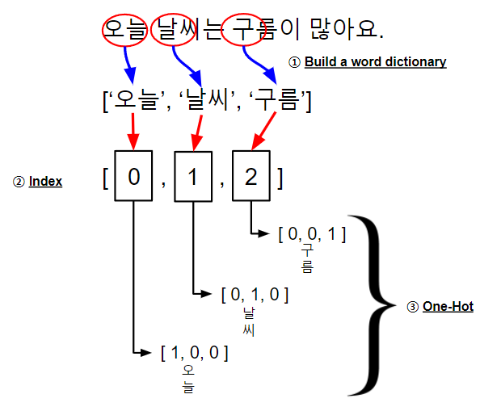

<h1 align="center">One-Hot-Encoding</h1>

#### [한국어](./One-Hot-Encoding(kor).md)

<h2 align="center">What is One-Hot-Encoding?</h2>

One-hot encoding is the most basic way to convert a word to a vector of numbers. As the name itself suggests, it refers to an encoding in which only one of the elements has a value of 1 and the remaining elements are 0. The result of one-hot encoding is called a one-hot vector and is also called a sparse vector because only one of its elements has a value of 1.

 > [🔍 Find out One-Hot Encoding Code!](./codes/one-hot-encoding.py)

The figure below shows the one-hot encoding process.

<a align="center">
    
</a>
<br>

To do one-hot encoding, you first need to create a dictionary called a word set. A dictionary here refers to a set of different words from a corpus. The number of all words in the corpus (word) determines the dimension of the one-hot vector. For example, if there are 100 words, the size of the one-hot vector is 100 dimensions. If a dictionary is built, a unique index number is assigned in the order of words in the dictionary. The index number of the word becomes the position of the element with a value of 1 in one-hot encoding.


<h2 align="center">'one-hot-encoding.py' Result</h2>

```
['오늘', '날씨', '구름']
{'오늘': 0, '날씨': 1, '구름': 2}
[[1. 0. 0.]
 [0. 1. 0.]
 [0. 0. 1.]]
```

One-hot encoding is used by many people because it has a better performance compared to the simple implementation method. However, in the case of a one-hot vector, it does not contain the meaning of a word or a relationship with a similar word because it is an encoded value based on the index value based on the word order. Also, as the size of the word dictionary increases, the dimension of the one-hot vector increases, which wastes memory and increases computational complexity. Also, one-hot vectors are inefficient because most elements have zero values.

