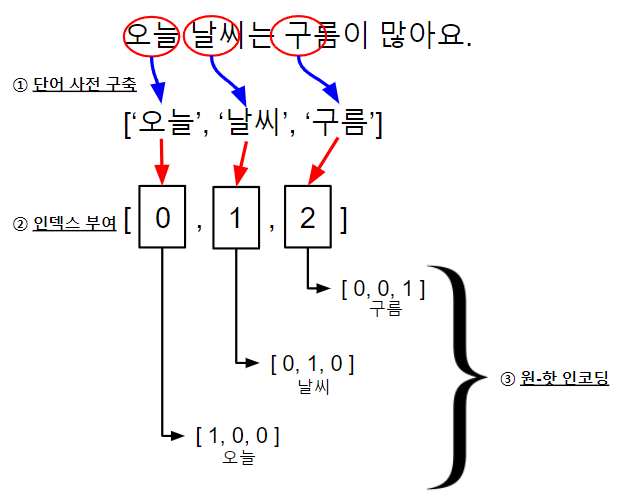

<h1 align="center">One-Hot-Encoding</h1>

<h2 align="center">What is One-Hot-Encoding?</h2>

원-핫 인코딩(one-hot encoding)은 단어를 숫자 벡터로 변환하는 가장 기본적인 방법입니다. 이름 자체에서도 알 수 있듯이 요소들 중 단 하나의 값만 1이고 나머지 요솟값은 0인 인코딩을 의미합니다. 원-핫 인코딩으로 나온 결과를 원-핫 벡터라고 부르며, 전체 요소 중 단 하나의 값만 1이기 때문에 희소(sparse) 벡터라고도 합니다.

 > [🔍 One-Hot Encoding 코드 보러 가기!](./codes/one-hot-encoding.py)

아래의 그림은 원-핫 인코딩 과정을 보여주고 있습니다.

<a align="center">
    
</a>
<br>

원-핫 인코딩을 하기 위해서는 단어 집합이라 불리는 사전을 먼저 만들어야 합니다. 여기서 사전은 말뭉치에서 나오는 서로 다른 단어의 집합을 의미합니다. 말뭉치(어절)에 존재하는 모든 단어의 수가 원-핫 벡터의 차원을 결정합니다. 예를 들어 100개의 단어가 존재한다면, 원-핫 벡터의 크기는 100차원이 됩니다. 사전 구축이 되었다면 사전 내 단어 순서대로 고유한 인덱스 번호를 부여합니다. 단어의 인덱스 번호가 원-핫 인코딩에서 1의 값을 가지는 요소의 위치가 됩니다.


<h2 align="center">'one-hot-encoding.py' Result</h2>

```
['오늘', '날씨', '구름']
{'오늘': 0, '날씨': 1, '구름': 2}
[[1. 0. 0.]
 [0. 1. 0.]
 [0. 0. 1.]]
```

원-핫 인코딩의 영우 간단한 구현 방법에 비해 좋은 성능을 가지기 때문에 많은 사람들에 의해서 사용되고 있습니다. 하지만, 원-핫 벡터의 경우 단순히 단어의 순서에 의한 인덱스 값은 기반으로 인코딩된 값이기 때문에 단어의 의미나 유사한 단어와의 관계를 담고 있지 않습니다. 또한, 단어 사전의 크기가 커짐에 따라 원-핫 벡터의 차원도 커지는데, 이때 메모리 낭비와 계산의 복잡도가 커집니다. 또한 원-핫 벡터는 대부분 요소가 0의 값을 가지고 있으므로 비효율적입니다.
